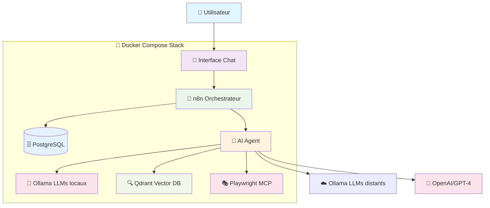

# 🎤 Talk n8n Agent - IA locales ou distantes, outils, et un chef d'orchestre nommé n8n

Comment faire bosser une IA avec vos outils du quotidien ? Dans cette conférence, on explore comment orchestrer des agents IA avec n8n, une plateforme d’automatisation simple et visuelle. On y connecte des modèles IA (locaux avec Ollama, ou distant) et des outils grâce au protocole MCP. Une approche concrète pour créer des assistants IA vraiment utiles… et maîtrisés. Venez, il y aura même une démo.

## 📝 À propos

Cette démonstration illustre comment créer un assistant IA intelligent en orchestrant des modèles locaux et distants avec n8n, incluant :

- 🤖 **Chat assistant** avec streaming en temps réel
- 📚 **Système RAG** (Retrieval-Augmented Generation) avec Qdrant
- 🔧 **Interface d'administration** pour la gestion des données
- 🐋 **Stack complète dockerisée** pour un déploiement facile

## 🏗️ Architecture



**Composants principaux :**
- **Interface Chat** : Frontend web moderne avec sélecteur de modèles (Local/Remote/OpenAI)
- **n8n** : Orchestrateur central gérant les workflows d'IA
- **AI Agent** : Logique métier avec capacités RAG et outils MCP
- **Modèles IA** : Support Ollama local/distant + APIs externes (OpenAI)
- **Playwright MCP** : Web scraping et automatisation navigateur
- **Qdrant** : Base vectorielle pour la recherche sémantique
- **PostgreSQL** : Persistance des données et sessions

## 🚀 Démarrage rapide

### Prérequis

- Linux, macOS ou Windows avec WSL2
- Docker & Docker Compose (ou podman ❤️)
- 8 Go de RAM minimum (recommandé: 16 Go)
- 10 Go d'espace disque libre

### 1. Cloner et configurer

```bash
git clone https://github.com/antoninBr/talk-n8n-agent.git
cd talk-n8n-agent

# Creer un fichier .env à partir de l'exemple
cp .env.example .env

# Générer les clés et configuration
./generate-key.sh
```

### 2. Lancer la stack complète et initialiser

```bash
# Démarrage automatique avec script
./start.sh --import --init-collections --setup-ollama
```

### 3. Accéder aux services

- **🎨 Chat Assistant** : https://localhost:8443
- **⚙️ Interface n8n** : http://localhost:5678
- **📊 Qdrant** : http://localhost:6333
- **🦙 Ollama** : http://localhost:11435
- **🎭 Playwright MCP** : http://localhost:3333

### 4. Creer un compte administrateur n8n

- Accédez à l'interface n8n (http://localhost:5678)
- Créez un compte administrateur

### 5. Modifications des credentials OpenAI et Ollama distant (optionnel)

- Accédez à l'interface n8n (http://localhost:5678)
- Mettez à jour les credentials pour OpenAI et Ollama distant selon vos besoins

### 6. Enregistrer votre instance n8n (optionnel)

- Dans l'interface n8n, allez dans "Settings" > "Instance"
- Cliquez sur "Register Instance" pour enregistrer votre instance n8n et bénéficier des mises à jour et du support (gratuit pour les instances auto-hébergées)

## 📁 Structure du projet

```
├── 📱 chat_app/              # Interface web du chat assistant
├── 📊 docs/                  # Slides de présentation (Reveal.js)
├── 🗃️ vector-store-qdrant/   # Configuration Qdrant
├── 🔧 workflows/             # Workflows n8n
├── 🔑 credentials/           # Credentials n8n (Ollama, Qdrant)
├── 🐋 docker-compose.yml     # Stack complète
└── 📜                        # start.sh, stop.sh, clean.sh...
```

## 🎯 Fonctionnalités démontrées

### 💬 Assistant Chat
- Streaming en temps réel
- Gestion de sessions
- Choix du modèle IA (local/distant/OpenAI)
- Interface moderne et responsive

### 🧠 Système RAG
- **Upload de documents** : PDF seulement
- **Web scraping** : Extraction automatique de contenu web
- **Base vectorielle** : Stockage et recherche sémantique avec Qdrant
- **Collections management** : Interface de gestion des données

### 🔧 Administration
- Monitoring des collections Qdrant
- Gestion des documents indexés
- Interface d'administration intégrée

## 🎤 Slides de présentation

Les slides sont disponibles dans le dossier `/docs` et utilisent Reveal.js.

**Sujet** : "IA locales ou distantes, outils, et un chef d'orchestre nommé n8n"

**Contenu** :
- Introduction aux agents IA
- Orchestration avec n8n
- Démonstration live du système RAG
- Bonnes pratiques et retours d'expérience

### Lien des slides live
https://antoninbr.github.io/talk-n8n-agent/

## ⚙️ Configuration avancée

### Variables d'environnement

Copiez `.env.example` vers `.env` et ajustez :

```bash
# Base de données
POSTGRES_DB=n8n
POSTGRES_USER=n8n
POSTGRES_PASSWORD=n8n
```

### Modèles IA supportés

- **Local** : Ollama (llama2, mistral, codellama...)
- **Distant** : OpenAI GPT, Anthropic Claude, etc.

## 🛠️ Scripts utiles

```bash
# Démarrer la stack la première fois
./start.sh --import --init-collections --setup-ollama

# Démarrer la stack
./start.sh

# Arrêter la stack
./stop.sh

# Nettoyer complètement (attention: supprime les données)
./clean.sh

# Creation des collections Qdrant
./setup-collections.sh

# Configurer Ollama avec les modèles
./setup-ollama.sh

# Importer les workflows n8n
./import-n8n-data.sh
```

## 📚 Documentation détaillée

- **Chat App** : Voir [chat_app/README.md](./chat_app/README.md)
- **Workflows n8n** : Documentation dans l'interface n8n
- **Configuration Qdrant** : [vector-store-qdrant/](./vector-store-qdrant/)

## 🐛 Dépannage

### Services qui ne démarrent pas
```bash
# Vérifier les logs
docker compose logs

# Redémarrer un service spécifique
docker compose restart n8n
```

### Problèmes de mémoire
- Ollama nécessite minimum 5 Go de RAM
- Ajustez les modèles selon votre configuration

### Port déjà utilisé

```bash
# Changer les ports expoés sur le l'host dans docker-compose.yml
# Par défaut: 8080 et 8443 (chat), 3333 (playwright-mcp), 11435 (ollama)
```

Pour le port 5678 (n8n), modifiez la variable d'environnement `N8N_PORT` dans `.env`.

## 🤝 Contribution

Cette démo est conçue pour être éducative et facilement adaptable. N'hésitez pas à :

- Forker le projet
- Adapter les workflows à vos besoins
- Contribuer aux améliorations

## 📄 Licence

MIT License - Voir le fichier [LICENSE](LICENSE) pour plus de détails.

---

**Présenté à Codeurs en Seine 2025**  
Par [Antonin Brugnot](https://github.com/antoninBr) https://www.youtube.com/watch?v=8UMn9bxHX34


**📚 Documentation principale :**
- [n8n Documentation](https://docs.n8n.io/) - Documentation officielle de n8n
- [Qdrant Documentation](https://qdrant.tech/documentation/) - Guide complet pour Qdrant Vector Store
- [Ollama Models](https://ollama.ai/library) - Bibliothèque des modèles Ollama disponibles

**🤖 IA et modèles :**
- [Installation Ollama](https://ollama.com/install.sh) - Script d'installation automatique d'Ollama
- [n8n Assistant GPT](https://chatgpt.com/g/g-SVatmGSdQ-n8n-assistant-by-nskha) - Assistant ChatGPT spécialisé pour n8n

**🔧 Workflows et ressources :**
- [n8n Workflows Community](https://n8n.io/workflows/) - Bibliothèque communautaire de workflows n8n
- [Reveal.js Documentation](https://revealjs.com/) - Framework de présentation utilisé pour les slides

**☁️ Cloud et déploiement :**
- [Docker × Google Cloud Partnership](https://cloud.google.com/blog/products/serverless/cloud-run-and-docker-collaboration) - Partenariat pour simplifier le déploiement Cloud Run
